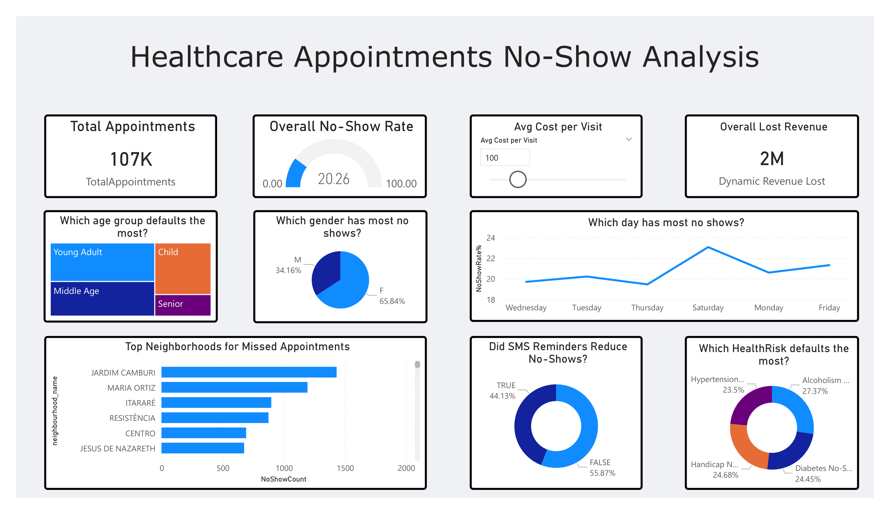

# AWS S3, Athena & Power BI Dashboard Project

## 📌 Project Overview
This project demonstrates an end‑to‑end analytics pipeline using **AWS S3**, **AWS Athena**, and **Power BI**.  
The workflow includes uploading raw CSV data to S3, transforming it into a **star schema** using Athena SQL, and building an interactive dashboard in Power BI.

---

### 📷 Power BI Dashboard Preview

---

## 🚀 Architecture Workflow

1. **Raw Data (CSV Files)**  
   CSV datasets serve as the initial data source.

2. **AWS S3 – Data Lake Storage**  
   - Raw CSV files were uploaded to an S3 bucket.  
   - S3 acts as the central storage layer for all data used in the project.

3. **AWS Athena – SQL-Based Transformation**  
   - Athena was configured directly on top of the S3 bucket.  
   - External tables were created using SQL DDL statements.  
   - Data was cleaned, filtered, and transformed using SQL queries.  
   - Fact and dimension tables were created following a **star schema**.

4. **Power BI – Dashboard & Reporting**  
   - Power BI connected to Athena using the ODBC driver.  
   - Fact and dimension tables were imported into Power BI.  
   - Data model relationships were built based on the star schema.  
   - Interactive visuals and KPIs were created.

---

## 🧱 Star Schema Design

### **Fact Table**
Contains measurable business metrics.  
Examples:
- `appointment_id` 
- `patient_id` 
- `neighbourhood_id` 
- `condition_id` 
- `date_id` 
- `sms_received`
- `showed_up` 
- `wait_days` 
- `age_group`

### **Dimension Tables**
Contain descriptive attributes.  
Examples:
- `Patient demographics`
- `Neighbourhood details` 
- `Medical conditions` 
- `Appointment date attributes`

Benefits:
- Faster queries  
- Cleaner data model  
- Better dashboard performance  

---

## 🛠️ Steps Performed

### **1. Uploading Data to S3**
- Created an S3 bucket for the project.
- Uploaded raw CSV file.
- Ensured proper folder structure for raw data.

### **2. Creating Tables in Athena**
- Defined external tables using SQL DDL statements.
- Queried and cleaned raw data using SQL.
- Created **dimension** and **fact** tables using SELECT queries.
- Stored transformed tables as Athena views.

### **3. Connecting Power BI to Athena**
- Installed the **Athena ODBC driver**.
- Configured DSN with AWS credentials.
- Imported fact and dimension tables into Power BI.
- Built relationships based on primary/foreign keys.
- Designed visuals, KPIs, and filters.

---

## 📊 Dashboard Features
- KPI cards for key metrics    
- Category‑wise breakdowns  
- Interactive slicers and filters  
- Drill‑down and drill‑through capabilities  

---

## 🧩 Technologies Used
| Component | Technology |
|----------|------------|
| Storage | AWS S3 |
| Query Engine | AWS Athena |
| Visualization | Power BI |
| Data Format | CSV |
| Data Modeling | Star Schema |

---